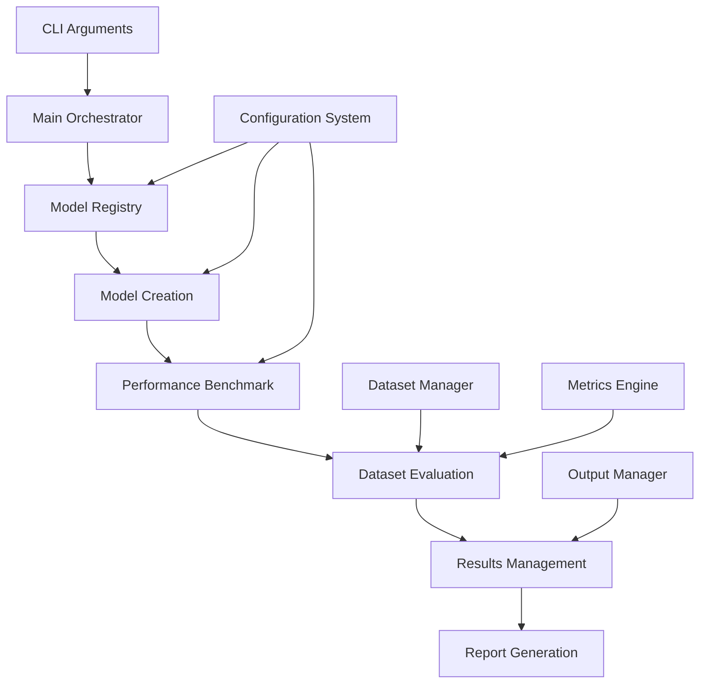

# LLM Evaluation Framework Architecture

**Version**: 2.0 (Post-Modular Refactoring)  
**Date**: September 17, 2025  
**Status**: Production Ready

## 🏗️ Architecture Overview

The LLM Evaluation Framework follows a **modular, extensible architecture** designed for evaluating multiple large language models across various benchmarks and datasets. The system prioritizes maintainability, performance, and easy extension for new model families.

### Core Design Principles

- **Modularity**: Each component has a single responsibility
- **Extensibility**: Adding new models requires minimal code changes
- **Performance**: Optimized for H100 GPU with 80GB VRAM
- **Maintainability**: Clean interfaces and well-defined boundaries
- **Reliability**: Comprehensive error handling and validation

## 📁 Directory Structure

```
llm_evaluation/
├── configs/                      # Configuration management
│   └── model_configs.py          # Model configurations and presets
├── models/                       # Model implementations
│   ├── base_model.py             # Abstract base class (382 lines)
│   ├── qwen_implementation.py    # Qwen model family (394 lines)
│   └── registry.py               # Model factory registry (102 lines)
├── evaluation/                   # Core evaluation modules
│   ├── run_evaluation.py         # Main orchestrator (966 lines, down from 1,135)
│   ├── performance.py            # Performance benchmarking (62 lines)
│   ├── dataset_evaluation.py     # Dataset evaluation logic (278 lines)
│   ├── reporting.py              # Results management (285 lines)
│   ├── dataset_manager.py        # Dataset management (595 lines)
│   └── metrics.py                # Evaluation metrics (876 lines)
├── evaluation_data/              # Dataset storage
│   ├── coding/                   # Programming datasets (HumanEval, MBPP)
│   ├── reasoning/                # Math/reasoning datasets (GSM8K)
│   ├── qa/                       # Question-answering datasets
│   ├── function_calling/         # Function calling benchmarks
│   └── meta/                     # Dataset metadata
├── test_results/                 # Evaluation outputs
│   ├── performance/              # Performance benchmark results
│   ├── predictions/              # Model prediction files
│   ├── reports/                  # Generated evaluation reports
│   └── comparisons/              # Model comparison analyses
├── scripts/                      # Utility scripts
├── docs/                         # Documentation
└── debug_evaluation.py          # Consolidated debugging utilities
```

## 🔧 Core Components

### 1. Model System (`models/`)

#### **Base Model (`base_model.py`)**
- Abstract interface for all model implementations
- Defines common methods: `generate()`, `benchmark()`, `cleanup()`
- Handles vLLM engine management and memory optimization
- Provides performance monitoring and resource tracking

#### **Model Registry (`registry.py`)**
- **Factory pattern** for model creation
- Maps model names to creation functions
- Supports multiple model families (Qwen, planned: Llama, Claude, etc.)
- Easy extension: add new models by updating registry

```python
# Adding a new model family
MODEL_REGISTRY = {
    "qwen3_8b": {"family": "qwen", "loader": create_qwen3_8b},
    "llama3_8b": {"family": "llama", "loader": create_llama3_8b},  # New!
    # ...
}
```

#### **Qwen Implementation (`qwen_implementation.py`)**
- Concrete implementation for Qwen model family
- Supports Qwen2.5-7B and Qwen2.5-14B variants
- Handles model-specific optimizations and configurations
- Integrated with vLLM for high-performance inference

### 2. Evaluation System (`evaluation/`)

#### **Main Orchestrator (`run_evaluation.py`)**
- **Simplified from 1,135 to 966 lines** (14.9% reduction)
- Coordinates all evaluation components
- Handles CLI argument parsing and workflow management
- Supports multiple evaluation modes: datasets-only, synthetic-only, full evaluation

#### **Performance Benchmarking (`performance.py`)**
- **PerformanceBenchmark class** with standardized tests
- Measures tokens/second across different prompt lengths
- Supports custom benchmarks and configurable test suites
- Integrated memory usage monitoring

#### **Dataset Evaluation (`dataset_evaluation.py`)**
- **DatasetEvaluator class** for dataset-specific evaluations
- Handles 10+ dataset types: HumanEval, MBPP, GSM8K, etc.
- Sample limiting and filtering capabilities
- Robust error handling and progress tracking

#### **Results Management (`reporting.py`)**
- **ResultsManager class** for output handling
- Generates comprehensive evaluation reports
- Supports multiple output formats (JSON, Markdown)
- Creates model comparison analyses

### 3. Configuration System (`configs/`)

#### **Model Configurations (`model_configs.py`)**
- **ModelConfig dataclass** with preset support
- Three presets: `balanced`, `performance`, `memory_optimized`
- Handles quantization settings, memory allocation, and performance tuning
- Extensible for new model families and optimization strategies

```python
# Example configuration
"qwen3_8b": ModelConfig(
    model_name="Qwen-3 8B Instruct",
    huggingface_id="Qwen/Qwen2.5-7B-Instruct",
    quantization_method="none",
    preset="balanced",
    gpu_memory_utilization=0.85,
    # ... additional settings
)
```

### 4. Data Management (`evaluation_data/`)

#### **Dataset Organization**
- **Structured by task type**: coding, reasoning, qa, function_calling
- **Metadata-driven**: Each dataset includes comprehensive metadata
- **Cached and optimized**: Local caching for performance
- **Version controlled**: Dataset versions and checksums tracked

#### **Supported Datasets**
- **Coding**: HumanEval, MBPP, CodeT5
- **Reasoning**: GSM8K, ARC Challenge
- **QA**: HellaSwag, AlpacaEval
- **Function Calling**: BFCL, ToolLlama
- **Benchmarks**: MT-Bench for multi-turn conversations

## 🚀 Workflow Architecture

### Evaluation Pipeline



### Component Interaction

1. **Initialization**: Main orchestrator loads configurations and initializes components
2. **Model Creation**: Registry creates model instances based on configuration
3. **Evaluation**: Sequential execution of performance and dataset evaluations
4. **Results Processing**: Aggregation, scoring, and report generation
5. **Cleanup**: Proper model unloading and resource cleanup

## 📊 Performance Characteristics

### Current Performance Metrics
- **qwen3_8b**: 120+ tokens/second
- **qwen3_14b**: 71+ tokens/second  
- **Memory Usage**: Optimized for H100 80GB VRAM
- **Evaluation Speed**: ~30 seconds for small dataset samples

### Optimization Features
- **Prefix Caching**: Enabled for repeated prompt patterns
- **CUDA Graphs**: Automatic optimization for inference
- **Batch Processing**: Configurable batch sizes per model
- **Memory Management**: Automatic model unloading between evaluations

## 🔌 Extension Points

### Adding New Model Families

1. **Create Model Implementation**:
   ```python
   # models/llama_implementation.py
   class LlamaModelImplementation(BaseModelImplementation):
       def generate(self, prompts, **kwargs):
           # Implementation
   ```

2. **Update Registry**:
   ```python
   # models/registry.py
   MODEL_REGISTRY["llama3_8b"] = {
       "family": "llama",
       "loader": create_llama3_8b
   }
   ```

3. **Add Configuration**:
   ```python
   # configs/model_configs.py
   "llama3_8b": ModelConfig(...)
   ```

### Adding New Datasets

1. **Add Dataset File**: Place in appropriate `evaluation_data/` subdirectory
2. **Update Dataset Manager**: Register dataset in `dataset_manager.py`
3. **Add Metadata**: Create metadata file with dataset information
4. **Test Integration**: Verify dataset loads and evaluates correctly

### Adding New Evaluation Types

1. **Extend Base Model**: Add new evaluation methods to `base_model.py`
2. **Update Orchestrator**: Add new evaluation workflow in `run_evaluation.py`
3. **Create Specialized Module**: Create dedicated module for complex evaluations
4. **Update Reporting**: Extend results management for new evaluation types

## 🛡️ Error Handling & Reliability

### Robust Error Management
- **Graceful Degradation**: Failed evaluations don't stop entire pipeline
- **Detailed Logging**: Comprehensive logging at all levels
- **Resource Cleanup**: Automatic cleanup on errors or completion
- **Validation**: Input validation and configuration checking

### Monitoring & Debugging
- **Performance Tracking**: Built-in performance monitoring
- **Memory Monitoring**: GPU memory usage tracking
- **Debug Utilities**: Consolidated debugging tools in `debug_evaluation.py`
- **Progress Reporting**: Real-time progress updates during evaluation

## 📈 Future Roadmap

### Planned Enhancements
- **Multi-GPU Support**: Distributed evaluation across multiple GPUs
- **Model Serving**: REST API for model evaluation services
- **Real-time Monitoring**: Web dashboard for evaluation monitoring
- **Advanced Analytics**: Statistical analysis and trend tracking
- **Cloud Integration**: Support for cloud-based model hosting

### Model Family Expansion
- **Llama Models**: Llama 3.1, Llama 3.2 series
- **Claude Models**: Anthropic Claude 3.5 series
- **Gemini Models**: Google Gemini Pro series
- **Specialized Models**: Code-specific, reasoning-specific models

## 🧪 Testing & Validation

### Quality Assurance
- **Automated Testing**: Comprehensive test suite
- **Integration Tests**: End-to-end workflow validation
- **Performance Regression**: Performance monitoring across versions
- **Configuration Validation**: Automated config verification

### Deployment
- **Environment Management**: Containerized deployment options
- **Dependency Management**: Clear dependency specifications
- **Documentation**: Comprehensive setup and usage documentation
- **Migration Support**: Smooth upgrades from previous versions

---

## 📝 Getting Started

### Quick Start
```bash
# Basic evaluation
python evaluation/run_evaluation.py --models qwen3_8b --preset balanced --datasets humaneval --sample-limit 10

# Multi-model comparison
python evaluation/run_evaluation.py --models qwen3_8b,qwen3_14b --preset performance --datasets humaneval,mbpp

# Full evaluation suite
python evaluation/run_evaluation.py --models qwen3_8b --preset balanced
```

### Configuration
- Models: Configure in `configs/model_configs.py`
- Datasets: Manage in `evaluation/dataset_manager.py`  
- Presets: Adjust in model configuration presets

This architecture provides a solid foundation for scalable, maintainable LLM evaluation while supporting easy extension for new models, datasets, and evaluation methodologies.